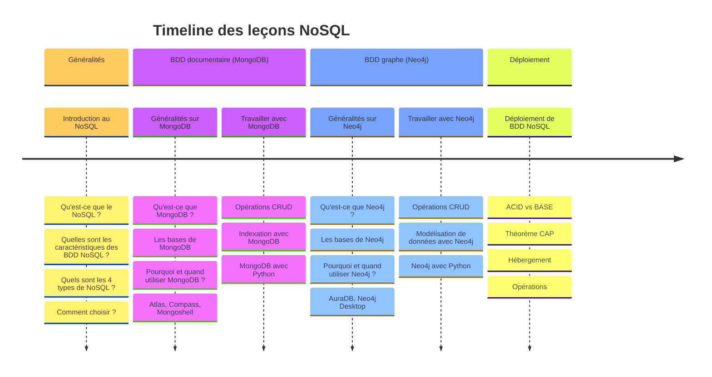

# NoSQL Databases

Ce cours sur les bases de données NoSQL est proposé pour les étudiants de l'ESIGELEC.

Il s'adresse aux étudiants de la dominante **BDTN(Big Data pour la Transformation Numérique)**.

Durant ce cours de 20h, seront abordés :

1. **Introduction aux bases de données NoSQL**: généralités, les types de BDD NoSQL
2. **Bases de données documentaires et MongoDB** : gestion des documents, et opérations CRUD.
3. **Bases de données graphes et Neo4j** : modélisation de graphes et gestion des relations.
4. **Déploiement cloud et architectures hybrides** : bonnes pratiques de développement et déploiement sur GCP.

En suivant ce cours, les étudiants développeront des compétences pratiques en MongoDB, Neo4j, CI/CD avec GitHub Actions, et déploiement cloud sur Google Cloud Platform (GCP).

## Liens rapides

Chapter |  Slides | Devoirs
:--- | :--- | :---
Chapter 1 | [MongoDB](https://github.com/nosql-esigelec/nosql-db/blob/main/courses/intro-to-nosql-mongo.pdf) | [Sprint 1](https://classroom.github.com/classrooms/118223005-inge25_3a_bdtn/assignments/gocod)
Chapter 2 | [Neo4j](https://github.com/nosql-esigelec/nosql-db/blob/main/courses/intro-to-nosql-neo4j.pdf) | [Sprint 2](https://classroom.github.com/classrooms/118223005-inge25_3a_bdtn/assignments/gocod)
Chapter 3 | [Deployment](https://github.com/nosql-esigelec/nosql-db/blob/main/courses/nosql-deployment.pdf) | Indisponible
Revisions | [Revisions](https://github.com/nosql-esigelec/nosql-db/blob/main/courses/revisions.pdf) | Indisponible
Bilan | [Bilan](https://github.com/nosql-esigelec/nosql-db/blob/main/courses/bilan.pdf) | Indisponible

Autres ressources:

* GitHub: organization [nosql-esigelec](https://github.com/nosql-esigelec), classroom invitation <https://classroom.github.com/classrooms/118223005-inge25_3a_bdtn>
